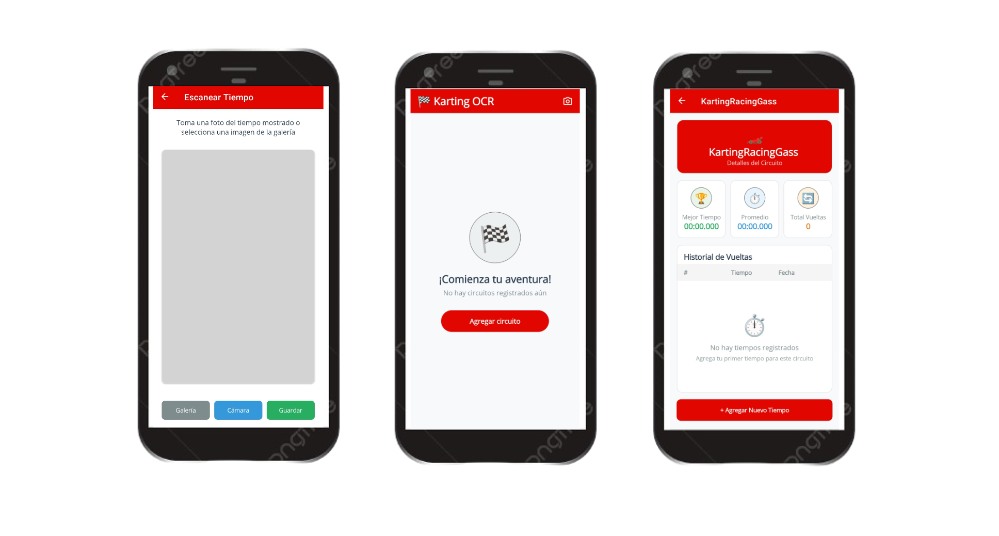

# Karting OCR



It’s a mobile app that lets you record your karting lap times by simply taking a photo of the lap time sheet.

## Installation
To install the app, you can use the following command:
```bash
git clone https://github.com/Maxbleu/Maui_Karting_OCR.git
```

## Usage
Before using the app, you need to go to `Services` > `OcrService` and set the azure `ApiKey` and `Endpoint` to your own API key.
